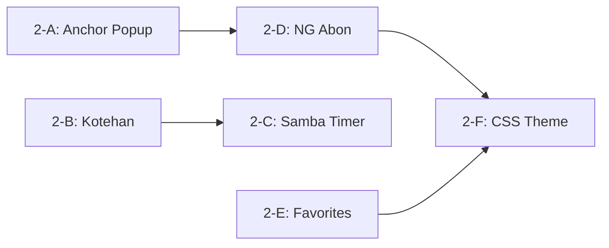

# Phase 2: 追加機能実装計画

## 前提

- Phase 1 (MVP) は完了済み: 板一覧/スレ一覧/DAT表示/投稿/永続化が動作
- 仕様は `[docs/bbs-browser-advanced-features.md](docs/bbs-browser-advanced-features.md)` に準拠
- パッケージマネージャー: bun (package.json に記載なし、devDependencies のみ)
- 型定義は `[src/types/](src/types/)` に集約済み

## 実装順序と依存関係




- 2-A と 2-B は独立して並行可能
- 2-C は 2-B の Folder.ini I/O を前提
- 2-D は 2-A のアンカー解析ユーティリティを参照
- 2-F はすべての UI 機能完成後に統合

---

## Phase 2-A: レスアンカーポップアップ

### 目的

`>>123` や `>>100-105` 形式のレス参照をクリッカブルリンクに変換し、ホバーでポップアップ表示する。

### 変更ファイル一覧

- **新規** `src/renderer/utils/anchor-parser.ts` -- アンカー正規表現 + HTML 変換ロジック
- **新規** `src/renderer/components/thread-view/ResPopup.tsx` -- ポップアップ表示コンポーネント
- **変更** `[src/renderer/components/thread-view/ThreadView.tsx](src/renderer/components/thread-view/ThreadView.tsx)` -- ResItem に anchor 変換 + hover イベントを統合
- **変更** `[src/renderer/hooks/use-sanitize.ts](src/renderer/hooks/use-sanitize.ts)` -- DOMPurify 設定に `#` (ページ内リンク) を許可
- **変更** `[src/types/file-format.ts](src/types/file-format.ts)` -- `MAX_POPUP_RES` は既に定義済み (10)

### 設計ポイント

**アンカー正規表現** (`anchor-parser.ts`):

```typescript
// 認識パターン: >>N, >>N-M, >>N,M,O, >N, ＞＞N
// 全角数字も半角に正規化
const ANCHOR_REGEX = /(?:&gt;|＞){1,2}([０-９\d]+(?:[,，][０-９\d]+)*(?:[-ー][０-９\d]+)?)/g;
```

**ポップアップ** (`ResPopup.tsx`):

- 位置計算: マウス座標からビューポート内に収まるよう調整
- 最大10レス表示 (`MAX_POPUP_RES`)
- 再帰防止: ポップアップ内アンカーは更にポップアップしない (depth=1)
- アクセシビリティ: `role="tooltip"`, `aria-describedby`

**ThreadView.tsx 変更差分の要点**:

- `sanitizeHtml(res.body)` の後に `convertAnchors()` を適用
- `onMouseEnter`/`onMouseLeave` でポップアップ表示制御
- アンカークリックで該当レス番号にスクロール (`scrollIntoView`)

### テスト

- `tests/unit/anchor-parser.test.ts`: 各パターン (>>N, >>N-M, 全角 etc.) のパース
- `tests/unit/sanitize.test.ts`: アンカー変換後もサニタイズ安全性を維持

---

## Phase 2-B: コテハン（固定ハンドル）

### 目的

板ごとにデフォルトの名前/メール欄を保存・自動入力する。

### 変更ファイル一覧

- **新規** `src/main/services/kotehan.ts` -- Folder.ini [Kotehan] セクション読み書き
- **変更** `[src/types/domain.ts](src/types/domain.ts)` -- `KotehanConfig` 型追加
- **変更** `[src/types/ipc.ts](src/types/ipc.ts)` -- `bbs:get-kotehan`, `bbs:set-kotehan` チャンネル追加
- **変更** `[src/main/ipc/handlers.ts](src/main/ipc/handlers.ts)` -- 新規 IPC ハンドラ登録
- **変更** `[src/renderer/stores/bbs-store.ts](src/renderer/stores/bbs-store.ts)` -- `kotehan` state + `fetchKotehan(boardUrl)` アクション
- **変更** `[src/renderer/components/post-editor/PostEditor.tsx](src/renderer/components/post-editor/PostEditor.tsx)` -- 初期値に kotehan を使用、投稿後に保存
- **変更** `[src/preload/index.ts](src/preload/index.ts)` -- 新チャンネル公開（自動）

### 設計ポイント

`**KotehanConfig**` (`domain.ts`):

```typescript
export interface KotehanConfig {
  readonly name: string;
  readonly mail: string;
}
```

`**kotehan.ts**`: INI パースは簡易実装（`[Kotehan]` セクション内の `Name=` / `Mail=` 行のみ読み書き）。既存の `file-io.ts` の `readFileSafe` / `atomicWriteFile` を使用。

**PostEditor 統合**: `selectBoard` 時に `fetchKotehan` を呼び、`name`/`mail` の初期値として設定。投稿成功時に `setKotehan` で自動保存。

### テスト

- `tests/unit/kotehan.test.ts`: INI パース/シリアライズ、空ファイル、既存セクション保持

---

## Phase 2-C: Samba タイマー

### 目的

板ごとの投稿間隔制限を管理し、連投防止のタイマーを表示する。

### 変更ファイル一覧

- **新規** `src/main/services/samba.ts` -- Samba.ini パース、投稿時刻記録、間隔チェック
- **変更** `[src/types/domain.ts](src/types/domain.ts)` -- `SambaInfo` 型追加
- **変更** `[src/types/ipc.ts](src/types/ipc.ts)` -- `bbs:get-samba`, `bbs:record-samba` チャンネル追加
- **変更** `[src/main/ipc/handlers.ts](src/main/ipc/handlers.ts)` -- Samba IPC ハンドラ
- **変更** `[src/main/services/post.ts](src/main/services/post.ts)` -- 投稿成功時に Samba 記録
- **変更** `[src/renderer/stores/bbs-store.ts](src/renderer/stores/bbs-store.ts)` -- `sambaInfo` state
- **変更** `[src/renderer/components/post-editor/PostEditor.tsx](src/renderer/components/post-editor/PostEditor.tsx)` -- 残り秒数表示、カウントダウン

### 設計ポイント

`**SambaInfo**` (`domain.ts`):

```typescript
export interface SambaInfo {
  /** 投稿間隔（秒） */
  readonly interval: number;
  /** 最終投稿時刻 (ISO string, null=未投稿) */
  readonly lastPostTime: string | null;
}
```

`**samba.ts**`: 

- `getSambaInterval(board)`: `@{bbsId}` -> ホスト名先頭部分 の順で検索
- `checkSambaTime(board)`: `(now - lastPostTime) > interval` を判定
- `recordSambaTime(board)`: `[Send]` セクションに時刻記録
- Samba.ini が存在しない場合はデフォルト値 (0秒=制限なし) を返す

**PostEditor 統合**: 

- Samba 残り秒数 > 0 のとき送信ボタンに「あと N 秒」表示
- `useEffect` + `setInterval(1000ms)` でカウントダウン
- 投稿成功時に `bbs:record-samba` を呼び出し

### テスト

- `tests/unit/samba.test.ts`: INI パース、キー検索順序、時刻判定、Fake Timer

---

## Phase 2-D: NG あぼーん

### 目的

NGword.txt に基づくレスフィルタリング（通常あぼーん/透明あぼーん）を実装する。

### 変更ファイル一覧

- **新規** `src/main/services/ng-abon.ts` -- NG ルールファイル読み込み、マッチングエンジン
- **新規** `src/types/ng.ts` -- NG 関連の型定義
- **新規** `src/renderer/components/ng-editor/NgEditor.tsx` -- NG ルール管理 UI
- **変更** `[src/types/ipc.ts](src/types/ipc.ts)` -- `ng:get-rules`, `ng:set-rules`, `ng:add-rule`, `ng:remove-rule` チャンネル
- **変更** `[src/main/ipc/handlers.ts](src/main/ipc/handlers.ts)` -- NG IPC ハンドラ
- **変更** `[src/renderer/stores/bbs-store.ts](src/renderer/stores/bbs-store.ts)` -- `ngRules` state + フィルタ適用ロジック
- **変更** `[src/renderer/components/thread-view/ThreadView.tsx](src/renderer/components/thread-view/ThreadView.tsx)` -- NG 適用済みレスの表示制御
- **変更** `[src/renderer/App.tsx](src/renderer/App.tsx)` -- NG エディタ表示ボタン

### 設計ポイント

**NG 型定義** (`src/types/ng.ts`):

```typescript
export const AbonType = {
  Normal: 'normal',     // 通常あぼーん（定型文に置換）
  Transparent: 'transparent', // 透明あぼーん（非表示）
} as const;
export type AbonType = (typeof AbonType)[keyof typeof AbonType];

export const NgMatchMode = {
  Plain: 'plain',   // プレーンテキスト AND
  Regexp: 'regexp',  // 正規表現 (ES RegExp)
} as const;
export type NgMatchMode = (typeof NgMatchMode)[keyof typeof NgMatchMode];

export interface NgRule {
  readonly id: string;          // UUID
  readonly abonType: AbonType;
  readonly matchMode: NgMatchMode;
  readonly tokens: readonly string[];   // AND 条件トークン群
  readonly boardId?: string | undefined;   // BOARD 指定
  readonly threadId?: string | undefined;  // THREAD 指定 (boardId/threadId)
  readonly enabled: boolean;
}
```

**マッチングエンジン** (`ng-abon.ts`):

1. DAT 行全体 (`name<>mail<>dateTime<>body`) に対してマッチ
2. 複数トークンは AND 条件
3. `RegExp` モード: ES 正規表現を使用（gikoNavi の AWK/Perl 互換は ES RegExp に読替え）
4. `boardId`/`threadId` が指定されている場合はスコープ外のスレッドには適用しない
5. 戻り値: `Res` をそのまま返す / `AbonType` に応じて置換/非表示

**NGword.txt パーサー**: 

- gikoNavi 互換フォーマットの読み書き
- 内部では `NgRule[]` に変換して保持
- `{{REGEXP}}` -> `matchMode: 'regexp'`
- 先頭TAB -> `abonType: 'transparent'`
- `{{BOARD:xxx}}` -> `boardId: 'xxx'`

**ThreadView 統合**:

- `ResItem` に `abonType` prop を追加
- `transparent`: レスを完全スキップ
- `normal`: 名前/メール/日時/本文を「あぼーん」に置換して表示
- 右クリックコンテキストメニューから「このレスを NG」操作

### テスト

- `tests/unit/ng-abon.test.ts`: パース、AND マッチ、正規表現、BOARD/THREAD スコープ、あぼーん置換

---

## Phase 2-E: お気に入り

### 目的

スレッド・板をブックマーク管理するツリー構造の機能を実装する。

### 変更ファイル一覧

- **新規** `src/main/services/favorite.ts` -- Favorite.xml 読み書き（XML パーサー使用）
- **新規** `src/types/favorite.ts` -- お気に入り型定義
- **新規** `src/renderer/components/favorite-tree/FavoriteTree.tsx` -- お気に入りツリー UI
- **変更** `[src/types/ipc.ts](src/types/ipc.ts)` -- `fav:load`, `fav:save`, `fav:add`, `fav:remove` チャンネル
- **変更** `[src/main/ipc/handlers.ts](src/main/ipc/handlers.ts)` -- お気に入り IPC ハンドラ
- **変更** `[src/renderer/stores/bbs-store.ts](src/renderer/stores/bbs-store.ts)` -- `favorites` state + CRUD アクション
- **変更** `[src/renderer/App.tsx](src/renderer/App.tsx)` -- 左ペインにタブ切替（板一覧 / お気に入り）
- **変更** `[src/renderer/components/thread-list/ThreadList.tsx](src/renderer/components/thread-list/ThreadList.tsx)` -- 右クリック「お気に入りに追加」

### 設計ポイント

**お気に入り型定義** (`src/types/favorite.ts`):

```typescript
export const FavItemType = {
  Board: 'board',
  Thread: 'thread',
} as const;
export type FavItemType = (typeof FavItemType)[keyof typeof FavItemType];

export interface FavItem {
  readonly id: string;         // UUID
  readonly type: FavItemType;
  readonly boardType: BoardType;
  readonly url: string;
  readonly title: string;
}

export interface FavFolder {
  readonly id: string;
  readonly title: string;
  readonly expanded: boolean;
  readonly children: readonly FavNode[];
}

export type FavNode = FavFolder | FavItem;
```

**Favorite.xml パーサー** (`favorite.ts`):

- Shift_JIS XML を iconv-lite でデコード後、DOM パーサー (`@xmldom/xmldom` 追加) で読み込み
- `<folder>` -> `FavFolder`, `<favitem>` -> `FavItem` に再帰的に変換
- 保存時は逆変換して Shift_JIS で原子書き込み
- **依存追加**: `@xmldom/xmldom` (DOM レベル XML パーサー)

**FavoriteTree UI**:

- 左ペインに「板一覧」「お気に入り」のタブ切替
- ツリー表示 (フォルダの展開/折りたたみ)
- ドラッグ&ドロップによる並べ替え（SHOULD、初期実装ではボタン操作）
- 板クリック -> `selectBoard`、スレッドクリック -> `openThread`
- 右クリック -> フォルダ作成/削除/リネーム

### テスト

- `tests/unit/favorite.test.ts`: XML パース/シリアライズ、ネスト、空ファイル、URL 置換

---

## Phase 2-F: CSS テーマ

### 目的

CSS カスタムプロパティを用いたテーマ切替機能を実装する（gikoNavi のスキン/テンプレートに代わる React 向けアプローチ）。

### 変更ファイル一覧

- **新規** `src/renderer/themes/` -- テーマ定義ディレクトリ
  - `default-dark.css` -- 現行ダークテーマ (CSS 変数化)
  - `default-light.css` -- ライトテーマ
  - `classic.css` -- gikoNavi 風クラシックテーマ
- **新規** `src/renderer/components/settings/ThemeSelector.tsx` -- テーマ選択 UI
- **変更** `[src/renderer/app.css](src/renderer/app.css)` -- CSS 変数ベースに書き換え
- **変更** 全コンポーネント -- ハードコードの Tailwind カラー (`bg-neutral-900` 等) を CSS 変数参照に置換
- **変更** `[src/renderer/stores/bbs-store.ts](src/renderer/stores/bbs-store.ts)` -- `theme` state + `setTheme` アクション
- **変更** `[src/renderer/App.tsx](src/renderer/App.tsx)` -- テーマ適用 + テーマ選択ボタン

### 設計ポイント

**CSS 変数体系** (例):

```css
:root {
  --color-bg-primary: #171717;
  --color-bg-secondary: #262626;
  --color-bg-tertiary: #404040;
  --color-text-primary: #f5f5f5;
  --color-text-secondary: #a3a3a3;
  --color-text-muted: #737373;
  --color-border: #404040;
  --color-accent: #3b82f6;
  --color-res-name: #4ade80;
  --color-res-age: #ef4444;
  --color-res-sage: #3b82f6;
  --color-res-new: #eab308;
}
```

**スキンテンプレート変数マッピング**: gikoNavi のテンプレート変数 (`<BOARDNAME/>`, `<THREADNAME/>` 等) は React の props/state で直接供給されるため、CSS テーマ方式で十分カバーできる。

**テーマ永続化**: `localStorage` にテーマ名を保存し、起動時に復元。

### テスト

- E2E: テーマ切替後のコントラスト比確認（Lighthouse A11y）

---

## 共通事項

### 各サブフェーズ完了後の品質チェック

```bash
bun run lint
bun run type-check
bun run build
bun run test
```

### ロールバック手順

各サブフェーズは独立した git ブランチ (`feature/phase2-a-anchor-popup` 等) で実装し、問題時は `git revert` で巻き戻し可能。

### 依存パッケージ追加

- Phase 2-E: `@xmldom/xmldom` (Favorite.xml パース用)
- それ以外の機能は既存パッケージで対応可能

