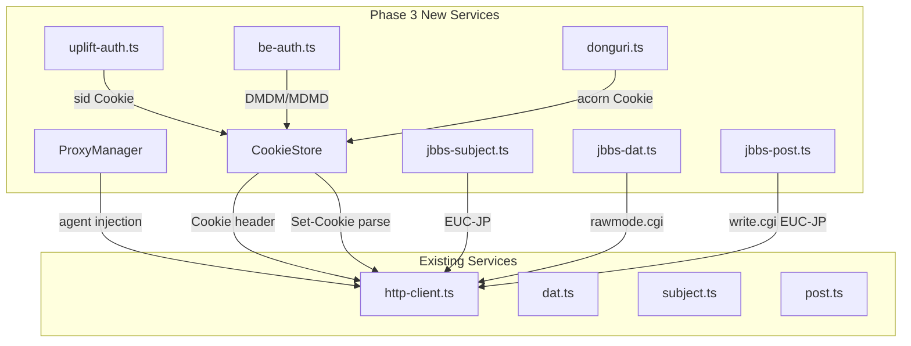

# Phase 3: 外部板・認証 実装計画

## 目的

5ch/2ch 以外の掲示板(したらば/JBBS)への対応と、5ch の認証系(UPLIFT, Be, どんぐり)の統合、およびプロキシ設定を実装する。

## 前提

- Phase 1 (MVP) + Phase 2 (NG, スキン, アンカー, お気に入り, Samba, コテハン) が完了済み
- `BoardType` enum に `Shitaraba` / `JBBS` が既に定義済み（[src/types/domain.ts](src/types/domain.ts)）
- 既存 `http-client.ts` はプロキシ未対応、Cookie 管理なし
- 投稿サービス `post.ts` に `detectResultType` で `grtDonguri` / `grtDngBroken` の判定が既にある
- ユーザー選択方針: **したらば専用サービス分離**(Plugin)、**全認証実装**、**http-agent ベースのプロキシ**

## アーキテクチャ概要




## 依存関係と実装順序

```
3-A: プロキシ基盤 ─────────────────────┐
3-B: Cookie/セッション管理 ──────────────┤
                                        ├─ 3-C: したらば/JBBS
                                        ├─ 3-D: UPLIFT認証
                                        ├─ 3-E: Be認証
                                        └─ 3-F: どんぐりシステム
```

---

## Phase 3-A: プロキシ基盤

### 目的

読み込み/書き込みで別プロキシを設定可能にする。

### 変更ファイル

- **新規**: `src/types/proxy.ts` — ProxyConfig 型定義
- **新規**: `src/main/services/proxy-manager.ts` — INI 読み書き、read/write Agent 生成
- **変更**: `src/types/api.ts` — `HttpRequestConfig` に `proxyAgent` フィールド追加
- **変更**: `src/main/services/http-client.ts` — `doRequest()` で agent を差し込み
- **変更**: `src/types/ipc.ts` — proxy 関連チャンネル追加
- **変更**: `src/main/ipc/handlers.ts` — proxy ハンドラ登録
- **新規**: `src/renderer/components/settings/ProxySettings.tsx` — プロキシ設定UI
- **変更**: `src/renderer/stores/bbs-store.ts` — proxyConfig 状態追加

### 技術詳細

- `https-proxy-agent` パッケージを追加（`http.Agent` 互換）
- `HttpRequestConfig` に optional `agent?: http.Agent` を追加
- `ProxyConfig` は INI 形式で永続化:
  ```ini
  [ReadProxy]
  Proxy=true
  Address=proxy.example.com
  Port=8080
  UserID=user
  Password=pass
  [WriteProxy]
  ...
  ```
- Password は `{ConfigDir}/proxy.ini` に保存。環境変数 override も SHOULD。
- `httpFetch` の呼び出し元(dat.ts, subject.ts, bbs-menu.ts, post.ts)はそれぞれ read/write を明示

### テスト

- `proxy-manager.test.ts`: INI パース/シリアライズ、Agent 生成ロジック
- `http-client.test.ts`: Agent が注入されることの検証（モック）

---

## Phase 3-B: Cookie/セッション管理フレームワーク

### 目的

認証 Cookie(sid, DMDM, MDMD, acorn)やサーバー発行 Cookie(SPID, PON)を一元管理する。

### 変更ファイル

- **新規**: `src/types/cookie.ts` — CookieEntry, CookieStoreState 型
- **新規**: `src/main/services/cookie-store.ts` — in-memory + ファイル永続化
- **変更**: `src/main/services/http-client.ts` — Cookie header 自動注入 / Set-Cookie 自動抽出
- **変更**: `src/main/services/post.ts` — Cookie ストアからの Cookie 取得
- **変更**: `src/types/ipc.ts` — cookie 関連チャンネル追加

### 技術詳細

- Cookie はドメイン+パスで管理。`file-format.ts` の既存 `CookieEntry` を拡張
- 永続化: `{ConfigDir}/cookies.txt` にドメインごと。`sid` は session-only (永続化しない)
- `httpFetch` に `cookieDomain` option を追加 → 自動で Cookie header を構築
- Set-Cookie レスポンスヘッダを自動パースして store に保存
- セキュリティ: Cookie 値はログに出力しない (既存契約の MUST)
- 既存 `post.ts` の hiddenFields からの SPID/PON を Cookie store 経由に統合

### テスト

- `cookie-store.test.ts`: 追加/取得/有効期限/ドメインマッチ/永続化

---

## Phase 3-C: したらば/JBBS 対応

### 目的

したらば/JBBS 板の閲覧・投稿を可能にする。既存5ch系サービスとは分離したプラグインとして実装。

### 変更ファイル

- **新規**: `src/main/services/plugins/jbbs-subject.ts` — JBBS subject.txt 取得
- **新規**: `src/main/services/plugins/jbbs-dat.ts` — rawmode.cgi 取得 + 7フィールドDAT パース
- **新規**: `src/main/services/plugins/jbbs-post.ts` — write.cgi 投稿 (EUC-JP)
- **新規**: `src/main/services/plugins/board-plugin.ts` — BoardPlugin インターフェース + ファクトリ
- **変更**: `src/types/domain.ts` — `JBBSRes` (7フィールド) or `Res` 型に `id` optional 追加
- **変更**: `src/main/ipc/handlers.ts` — BoardPlugin 経由のディスパッチに変更
- **変更**: `src/main/services/bbs-menu.ts` — したらば板一覧への対応（手動追加 or JBBS bbsmenu）

### 技術詳細

**BoardPlugin インターフェース:**

```typescript
interface BoardPlugin {
  fetchSubject(board: Board, dataDir: string): Promise<SubjectFetchResult>;
  fetchDat(board: Board, threadId: string, dataDir: string): Promise<DatFetchResult>;
  postResponse(params: PostParams, board: Board): Promise<PostResult>;
}
```

**JBBS DAT フォーマット (7フィールド):**

```
レス番号<>名前<>メール<>日時<>本文<>スレッドタイトル<>ID
```

- `rawmode.cgi` が返す HTML を DAT 形式に変換
- 欠番(あぼーん)が発生する → レス番号フィールドで管理
- `Res` 型に optional `id` フィールドを追加して JBBS の ID を保持

**JBBS URL パターン:**

- subject.txt: `https://jbbs.shitaraba.net/{dir}/{bbs}/subject.txt`
- DAT: `https://jbbs.shitaraba.net/bbs/rawmode.cgi/{dir}/{bbs}/{key}/`
- 差分: `https://jbbs.shitaraba.net/bbs/rawmode.cgi/{dir}/{bbs}/{key}/{既存レス数+1}-`
- 投稿: `https://jbbs.shitaraba.net/bbs/write.cgi/{dir}/{bbs}/{key}/`

**エンコーディング:**

- したらば: 読み Shift_JIS / 書き EUC-JP
- JBBS (まちBBS): 読み EUC-JP / 書き EUC-JP

**Board モデル拡張:**
`Board` に JBBS 用の `dir` (ディレクトリ) フィールドが必要。既存の `Board` interface に optional `jbbsDir?: string` を追加。

### テスト

- `jbbs-dat.test.ts`: 7フィールドDAT パース、欠番処理、rawmode HTML→DAT変換
- `jbbs-subject.test.ts`: JBBS subject.txt パース
- `jbbs-post.test.ts`: EUC-JP エンコード投稿パラメータ構築
- `board-plugin.test.ts`: ファクトリのディスパッチ

---

## Phase 3-D: UPLIFT 認証

### 目的

5ch 有料会員の UPLIFT ログインを実装し、過去ログ取得と投稿時の sid 付与を可能にする。

### 変更ファイル

- **新規**: `src/types/auth.ts` — AuthState, UpliftCredentials 型
- **新規**: `src/main/services/uplift-auth.ts` — ログインフロー
- **変更**: `src/main/services/dat.ts` — oyster URL に `?sid=` 付与
- **変更**: `src/main/services/post.ts` — 投稿時に `sid` パラメータ追加
- **変更**: `src/types/ipc.ts` — auth チャンネル追加
- **新規**: `src/renderer/components/auth/AuthPanel.tsx` — ログインUI
- **変更**: `src/renderer/stores/bbs-store.ts` — auth 状態追加

### 技術詳細

- `POST https://uplift.5ch.net/log` with `usr`, `pwd`, `log=`
- Referer: `https://uplift.5ch.net/login`
- レスポンスから `sid` Cookie を取得 → Cookie store に保存 (session-only)
- セッションID = `{UserAgent}:{SessionValue}` 形式
- 過去ログ URL: `{Board.URL の base}/oyster/{先頭4文字}/{ThreadID}.dat?sid={SessionID}`
- **セキュリティ**: パスワードは平文保存しない。UI での入力のみ、メモリ内保持。

### テスト

- `uplift-auth.test.ts`: ログインフロー(成功/失敗)、sid 抽出、Cookie store 連携

---

## Phase 3-E: Be 認証

### 目的

5ch Be アカウントのログインと、投稿時の DMDM/MDMD Cookie 付与、Be プロフィールリンク表示。

### 変更ファイル

- **新規**: `src/main/services/be-auth.ts` — Be ログインフロー
- **変更**: `src/main/services/post.ts` — DMDM/MDMD Cookie 付与
- **変更**: `src/renderer/components/thread-view/ThreadView.tsx` — Be プロフィールリンク
- **変更**: `src/types/auth.ts` — BeCredentials 追加
- **変更**: `src/renderer/components/auth/AuthPanel.tsx` — Be ログインタブ追加

### 技術詳細

- `POST https://be.5ch.net/log` with `mail`, `pass`
- Cookie: `DMDM`, `MDMD` on `.5ch.net` → Cookie store に永続化
- DAT 日時フィールドの `BE:34600695-4` を検出し、プロフィールリンクに変換:
`https://be.5ch.net/test/p.php?i=34600695/{レス番号}`
- **セキュリティ**: Be パスワードも平文保存しない

### テスト

- `be-auth.test.ts`: ログインフロー、Cookie 抽出
- ThreadView の Be リンク変換テスト

---

## Phase 3-F: どんぐりシステム

### 目的

5ch のどんぐり(acorn) Cookie を管理し、投稿時の自動付与とエラーハンドリングを実装。

### 変更ファイル

- **新規**: `src/main/services/donguri.ts` — acorn Cookie 管理、状態チェック
- **変更**: `src/main/services/post.ts` — acorn Cookie 自動付与、grtDonguri/grtDngBroken ハンドリング強化
- **変更**: `src/renderer/components/post-editor/PostEditor.tsx` — どんぐりステータス表示
- **変更**: `src/types/auth.ts` — DonguriState 追加
- **変更**: `src/renderer/stores/bbs-store.ts` — donguri 状態追加

### 技術詳細

- `acorn` Cookie は Cookie store で管理
- 投稿レスポンスで `grtDonguri` → 「どんぐりを消費しました」表示、再投稿不可
- `grtDngBroken` (`broken_acorn`, `[1044]`, `[1045]`, `[0088]`) → Cookie 再取得を促すUI
- 関連 URL:
  - `https://donguri.5ch.net/` (トップ)
  - `https://donguri.5ch.net/auth` (認証)
- **注意**: どんぐり判定文字列は運用で変化する可能性あり → feature flag で対応

### テスト

- `donguri.test.ts`: acorn Cookie 有無チェック、エラーパターン判定
- PostEditor の UI 状態テスト

---

## 変更差分サマリ

### 新規ファイル (14)

- `src/types/proxy.ts`, `src/types/cookie.ts`, `src/types/auth.ts`
- `src/main/services/proxy-manager.ts`
- `src/main/services/cookie-store.ts`
- `src/main/services/plugins/board-plugin.ts`
- `src/main/services/plugins/jbbs-subject.ts`
- `src/main/services/plugins/jbbs-dat.ts`
- `src/main/services/plugins/jbbs-post.ts`
- `src/main/services/uplift-auth.ts`
- `src/main/services/be-auth.ts`
- `src/main/services/donguri.ts`
- `src/renderer/components/auth/AuthPanel.tsx`
- `src/renderer/components/settings/ProxySettings.tsx`

### 変更ファイル (10)

- `src/types/api.ts`, `src/types/domain.ts`, `src/types/ipc.ts`
- `src/main/services/http-client.ts`
- `src/main/services/dat.ts`, `src/main/services/post.ts`
- `src/main/ipc/handlers.ts`
- `src/renderer/stores/bbs-store.ts`
- `src/renderer/components/thread-view/ThreadView.tsx`
- `src/renderer/components/post-editor/PostEditor.tsx`

### 新規パッケージ

- `https-proxy-agent` (プロキシ Agent)

## 検証手順

各サブフェーズ完了時に:

1. `npm run lint` — ESLint パス
2. `npm run type-check` — TypeScript 型チェックパス
3. `npm run test` — ユニットテストパス
4. `npm run build` — ビルド成功

## ロールバック手順

- 各サブフェーズは独立した Git コミット単位
- 問題発生時は `git revert` で該当コミットを戻す
- 新規ファイルのみの追加が主なので、既存機能への影響は最小限

