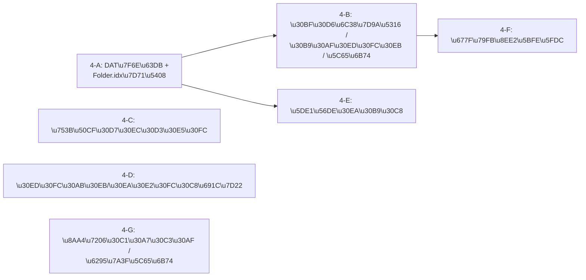

# Phase 4: 高度機能 実装計画

## 前提

- Phase 1 (MVP) + Phase 2 (NG/スキン/アンカー/お気に入り/Samba/コテハン) + Phase 3 (外部板/認証/プロキシ) が完了済み
- `ThreadIndex` に既に `kokomade` / `scrollTop` フィールドが存在するが、**未使用** (`buildUpdatedIndex` / `saveFolderIdx` が呼ばれていない)
- `bbs-store` のタブはメモリのみ (永続化なし)
- ユーザー選択方針: **インライン自動サムネイル埋め込み**、**巡回リスト完全実装**、**リモート検索 feature flag 付き実装**

## 依存関係と実装順序

---

## Phase 4-A: DAT 置換 + Folder.idx 統合

### 目的

`replace.ini` による DAT テキスト置換と、subject 取得フローへの Folder.idx 永続化統合。

### 変更ファイル

- **新規**: `src/types/replace.ts` -- ReplaceRule 型定義
- **新規**: `src/main/services/dat-replace.ts` -- replace.ini パース + DAT 置換ロジック
- **変更**: [src/main/services/dat.ts](src/main/services/dat.ts) -- DAT 保存前に `applyDatReplace()` を挟む
- **変更**: [src/main/services/subject.ts](src/main/services/subject.ts) -- `fetchSubject` で `buildUpdatedIndex` + `saveFolderIdx` を実行するよう統合
- **変更**: [src/types/ipc.ts](src/types/ipc.ts) -- `bbs:update-thread-index` (kokomade/scrollTop 書き込み) チャンネル追加
- **変更**: [src/main/ipc/handlers.ts](src/main/ipc/handlers.ts) -- 新規ハンドラ登録

### 技術詳細

- `replace.ini` フォーマット: `検索文字列[TAB]置換文字列`、`<>` 含む行はスキップ、空置換は同長の空白
- DAT デコード後・ローカル保存前のタイミングで適用 (`Setting.ReplaceDat = true` のみ)
- `buildUpdatedIndex` は既存実装だが呼び出されていない。`fetchSubject` の戻り値構築時にマージし `saveFolderIdx` で永続化

### テスト

- `dat-replace.test.ts`: replace.ini パース、置換ロジック、エスケープ、`<>` スキップ

---

## Phase 4-B: タブ永続化 / スクロール位置復元 / ここまで読んだ / 閲覧履歴

### 目的

タブ状態のディスク永続化、スクロール位置の保存/復元、「ここまで読んだ」マーカー、閲覧履歴を実装。

### 変更ファイル

- **新規**: `src/types/history.ts` -- BrowsingHistoryEntry, AddressHistoryEntry 型
- **新規**: `src/main/services/tab-persistence.ts` -- tab.sav 読み書き
- **新規**: `src/main/services/browsing-history.ts` -- 閲覧履歴管理
- **変更**: [src/types/ipc.ts](src/types/ipc.ts) -- tab/history チャンネル追加
- **変更**: [src/renderer/stores/bbs-store.ts](src/renderer/stores/bbs-store.ts) -- タブに kokomade/scrollTop 追加、永続化アクション、履歴状態
- **変更**: [src/renderer/components/thread-view/ThreadView.tsx](src/renderer/components/thread-view/ThreadView.tsx) -- スクロール位置保存/復元、「ここまで読んだ」マーカー表示、表示範囲切替

### 技術詳細

- **tab.sav**: 1行1タブ `boardUrl[TAB]threadId[TAB]title`、起動時に復元
- **scrollTop**: タブ切替/クローズ時に `scrollRef.scrollTop` を保存 → Folder.idx に永続化 → 再オープン時に `scrollTo`
- **ここまで読んだ**: Folder.idx の `kokomade` フィールド。ThreadView に区切り線を表示 (Bookmark.html テンプレート相当)。右クリックで「ここまで読んだ」設定
- **閲覧履歴**: 最近表示したスレッドを `{ConfigDir}/history.json` に保存。最大件数制限あり、再訪問時は先頭に移動
- **表示範囲**: 全件 / ここまで読んだ以降 / 新着のみ / 末尾 N 件 をタブごとに切替

### テスト

- `tab-persistence.test.ts`: tab.sav パース/シリアライズ
- `browsing-history.test.ts`: 追加/重複/上限/永続化

---

## Phase 4-C: 画像プレビュー

### 目的

レス本文中の画像 URL を検出し、インラインサムネイルとして自動埋め込み表示する。`extpreview.ini` にも対応。

### 変更ファイル

- **新規**: `src/types/preview.ts` -- ImagePreviewConfig, ExtPreviewRule 型
- **新規**: `src/main/services/image-preview.ts` -- 画像 URL 検出、extpreview.ini パース
- **新規**: `src/renderer/components/thread-view/ImageThumbnail.tsx` -- サムネイルコンポーネント
- **変更**: [src/renderer/components/thread-view/ThreadView.tsx](src/renderer/components/thread-view/ThreadView.tsx) -- 画像 URL をサムネイルに変換

### 技術詳細

- **画像 URL パターン**: `.jpg`, `.jpeg`, `.gif`, `.png`, `.webp`, `.jpg:large`, `.jpg:orig`, `?format=jpg`, `?format=png`
- **サムネイル**: `` を `loading="lazy"` + max-width/height 制限で表示。クリックで原寸表示 (オーバーレイ)
- **extpreview.ini**: `正規表現URL[TAB]コマンド[TAB]確認[TAB]続行` フォーマット。`nop` はスキップ、コマンドは `shell.openExternal` で実行 (URL は DOMPurify + allowlist でサニタイズ済みのもののみ)
- **セキュリティ**: 画像読み込みは CSP の `img-src` で制限。外部コマンド実行は URL の allowlist 検証必須

### テスト

- `image-preview.test.ts`: URL パターンマッチ、extpreview.ini パース

---

## Phase 4-D: ローカル検索 / リモート検索

### 目的

ローカル DAT ファイルの全文検索と、dig.2ch.net API によるリモートスレッド検索を実装。

### 変更ファイル

- **新規**: `src/types/search.ts` -- SearchQuery, SearchResult, SearchTarget 型
- **新規**: `src/main/services/local-search.ts` -- ローカル DAT grep
- **新規**: `src/main/services/remote-search.ts` -- dig.2ch.net API クライアント (feature flag 付き)
- **新規**: `src/renderer/components/search/SearchPanel.tsx` -- 検索 UI パネル
- **変更**: [src/types/ipc.ts](src/types/ipc.ts) -- `search:local`, `search:remote` チャンネル追加
- **変更**: [src/main/ipc/handlers.ts](src/main/ipc/handlers.ts) -- 検索ハンドラ登録
- **変更**: [src/renderer/App.tsx](src/renderer/App.tsx) -- 検索パネル配置

### 技術詳細

- **ローカル検索**: 選択板の全 DAT ファイルを読み、正規表現 (`TGrep` 相当) で名前/メール/ID/本文をマッチ。結果は板名+スレタイ+レス番号+マッチ行で返す
- **リモート検索 (dig.2ch.net)**: `http://dig.2ch.net/?keywords={kw}&AndOr=0&maxResult=50&Sort=0&Link=1&json=1`。JSON レスポンス `{subject, ita, resno, url}[]`。feature flag `ENABLE_REMOTE_SEARCH` で制御、API エラー時はフォールバック (ローカルのみに切替)
- **検索 UI**: 左ペインに検索タブ追加 (板一覧 / お気に入り / 検索)。結果リストをクリックでスレッドを開く

### テスト

- `local-search.test.ts`: DAT grep ロジック、正規表現マッチ
- `remote-search.test.ts`: API レスポンスパース、feature flag

---

## Phase 4-E: 巡回リスト

### 目的

板/スレッドの巡回リストを管理し、タイマーによる定期自動取得を実装。

### 変更ファイル

- **新規**: `src/types/round.ts` -- RoundBoardEntry, RoundItemEntry 型
- **新規**: `src/main/services/round-list.ts` -- RoundBoard.2ch / RoundItem.2ch 読み書き + 巡回実行ロジック
- **新規**: `src/renderer/components/round/RoundPanel.tsx` -- 巡回リスト管理 UI
- **変更**: [src/types/ipc.ts](src/types/ipc.ts) -- round チャンネル追加
- **変更**: [src/main/ipc/handlers.ts](src/main/ipc/handlers.ts) -- round ハンドラ登録
- **変更**: [src/renderer/App.tsx](src/renderer/App.tsx) -- 巡回パネル配置

### 技術詳細

- **ファイル形式**: バージョン行 `2.00` + `{URL}#1{BoardTitle}#1{RoundName}` (板) or `{URL}#1{BoardTitle}#1{FileName}#1{ThreadTitle}#1{RoundName}` (スレ)
- **巡回実行**: `setInterval` ベースのタイマー (設定可能な間隔)。実行時は `fetchSubject` / `fetchDat` を順次呼び出し、Folder.idx を更新
- **レート制限**: 未ログイン時は間隔制限あり。エラー発生時は `ErrorBoard.2ch` / `ErrorItem.2ch` に記録
- **UI**: 巡回リスト管理 (追加/削除/名前変更)、一括手動更新ボタン、自動巡回 ON/OFF トグル、最終巡回時刻表示

### テスト

- `round-list.test.ts`: ファイルパース/シリアライズ、巡回アイテム管理

---

## Phase 4-F: 板移転対応

### 目的

板一覧更新時にURLの変更を検出し、お気に入り/タブ/巡回リスト内のURLを一括置換する。

### 変更ファイル

- **新規**: `src/main/services/board-transfer.ts` -- 移転検出 + URL 一括置換
- **変更**: [src/main/services/bbs-menu.ts](src/main/services/bbs-menu.ts) -- fetchMenu 時に移転検出を呼び出し
- **変更**: [src/main/services/tab-persistence.ts](src/main/services/tab-persistence.ts) -- tab.sav 内 URL 置換
- **変更**: [src/main/services/favorite.ts](src/main/services/favorite.ts) -- Favorite.xml 内 URL 置換
- **変更**: [src/main/services/round-list.ts](src/main/services/round-list.ts) -- 巡回リスト内 URL 置換

### 技術詳細

- **検出ロジック**: 旧板一覧と新板一覧の `Board.url` を比較。パス (bbsId) が同一でホストが異なる → 移転と判定
- **置換対象**: お気に入り (`FavoritesURLReplace`)、巡回リスト (`RoundListURLReplace`)、タブ (`TabFileURLReplace`)
- **ホストのみ置換**: パスは維持し、ホスト部分だけ新しいサーバーに差し替え

### テスト

- `board-transfer.test.ts`: 移転検出ロジック、URL 置換

---

## Phase 4-G: 投稿誤爆チェック / 投稿履歴

### 目的

投稿先の不一致検出と、投稿内容の履歴保存/ローテーションを実装。

### 変更ファイル

- **新規**: `src/types/post-history.ts` -- PostHistoryEntry 型
- **新規**: `src/main/services/post-history.ts` -- sent.ini 読み書き + ローテーション
- **変更**: [src/renderer/components/post-editor/PostEditor.tsx](src/renderer/components/post-editor/PostEditor.tsx) -- 誤爆チェックダイアログ + 投稿後に履歴保存
- **変更**: [src/types/ipc.ts](src/types/ipc.ts) -- `post:save-history` チャンネル追加

### 技術詳細

- **誤爆チェック**: アクティブタブの `boardUrl + threadId` と投稿先の `boardUrl + threadId` が不一致の場合、確認ダイアログを表示
- **投稿履歴**: `{AppDir}/sent.ini` に投稿内容を追記。サイズが `SentIniFileSize` (デフォルト 1MB) を超えたら `sent.ini.1` にローテーション
- **フォーマット**: `[timestamp]` セクション + `BoardUrl`, `ThreadId`, `Name`, `Mail`, `Message` キー

### テスト

- `post-history.test.ts`: 履歴追記、ローテーション判定

---

## 変更差分サマリ

### 新規ファイル (15)

- `src/types/replace.ts`, `src/types/history.ts`, `src/types/preview.ts`, `src/types/search.ts`, `src/types/round.ts`, `src/types/post-history.ts`
- `src/main/services/dat-replace.ts`, `src/main/services/tab-persistence.ts`, `src/main/services/browsing-history.ts`
- `src/main/services/image-preview.ts`, `src/main/services/local-search.ts`, `src/main/services/remote-search.ts`
- `src/main/services/round-list.ts`, `src/main/services/board-transfer.ts`, `src/main/services/post-history.ts`

### 新規コンポーネント (3)

- `src/renderer/components/thread-view/ImageThumbnail.tsx`
- `src/renderer/components/search/SearchPanel.tsx`
- `src/renderer/components/round/RoundPanel.tsx`

### 変更ファイル (10+)

- `src/types/ipc.ts`, `src/main/ipc/handlers.ts`
- `src/main/services/dat.ts`, `src/main/services/subject.ts`, `src/main/services/bbs-menu.ts`
- `src/main/services/favorite.ts`
- `src/renderer/stores/bbs-store.ts`, `src/renderer/App.tsx`
- `src/renderer/components/thread-view/ThreadView.tsx`
- `src/renderer/components/post-editor/PostEditor.tsx`

## 検証手順

各サブフェーズ完了時に:

1. `npm run lint` -- ESLint パス
2. `npm run type-check` -- TypeScript 型チェックパス
3. `npm run test` -- ユニットテストパス
4. `npm run build` -- ビルド成功

## ロールバック手順

- 各サブフェーズは独立した Git コミット単位
- 問題発生時は `git revert` で該当コミットを戻す

