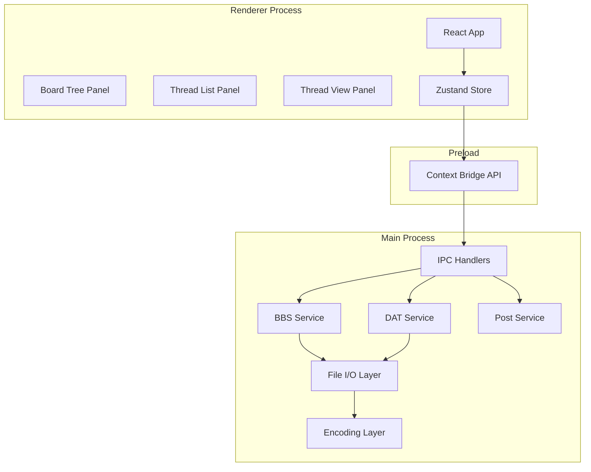

# VBBB 汎用掲示板ブラウザ 開発計画

## 技術スタック

- **ランタイム**: Electron (Node.js) + electron-vite
- **パッケージマネージャー**: bun
- **フロントエンド**: React 19 + TailwindCSS v4 + @mdi/js (Material Design Icons)
- **バリデーション**: Zod (API/ファイルI/Oの入出力境界)
- **テスト**: Vitest (ユニット) + Playwright (E2E)
- **ビルド**: Vite + electron-builder
- **文字コード**: iconv-lite (Shift_JIS / EUC-JP 変換)
- **サニタイズ**: DOMPurify (DAT/subject表示前のHTML無害化)
- **状態管理**: Zustand (軽量で型安全)
- **CI**: GitHub Actions

## アーキテクチャ




### ディレクトリ構造

```
src/
  main/                # Electron メインプロセス
    index.ts
    ipc/               # IPC ハンドラ (板一覧/スレ一覧/DAT/投稿)
    services/          # ビジネスロジック
      bbs-menu.ts      # 板一覧取得・パース
      subject.ts       # subject.txt 取得・パース
      dat.ts           # DAT 取得・差分マージ
      post.ts          # 投稿フロー
      file-io.ts       # 原子書き込み・ロック
      encoding.ts      # Shift_JIS/EUC-JP 変換
      http-client.ts   # User-Agent/リトライ/バックオフ
    config/            # 設定管理
  preload/
    index.ts           # contextBridge で安全にAPI公開
  renderer/
    App.tsx
    components/
      layout/          # 3ペインレイアウト
      board-tree/      # 板一覧ツリー
      thread-list/     # スレ一覧テーブル
      thread-view/     # スレ本文表示
      post-editor/     # 投稿エディタ
      common/          # 共通UIコンポーネント
    hooks/
    stores/            # Zustand ストア
  types/               # 型定義一元管理
    domain.ts          # BBS/Category/Board/Thread/Res
    api.ts             # HTTP通信関連
    ipc.ts             # IPC チャンネル型定義
    file-format.ts     # Folder.idx/subject.txt等のファイル型
    zod-schemas.ts     # Zodスキーマ (ランタイム検証)
```

## 開発フェーズ

### Phase 1: MVP (今回の対象)

基本的な掲示板閲覧・投稿フローを動作させる。

**Phase 1-A: プロジェクトセットアップ**

- electron-vite でプロジェクト初期化
- tsconfig.json (strict + ユーザールールの全オプション)
- ESLint (typescript-eslint強化ルール)
- TailwindCSS + PostCSS
- Vitest + Playwright 設定
- GitHub Actions CI (lint -> type-check -> test -> build)
- .editorconfig / .gitattributes (LF, UTF-8)

**Phase 1-B: 型定義・スキーマ基盤**

- `src/types/domain.ts`: BBS, Category, Board, ThreadItem, Res, IndexRec 等
- `src/types/zod-schemas.ts`: 入出力バリデーション用Zodスキーマ
- `src/types/ipc.ts`: IPC チャンネル名・ペイロード型

**Phase 1-C: メインプロセス (バックエンド)**

- `http-client.ts`: User-Agent付与, タイムアウト, 指数バックオフ, If-Modified-Since
- `encoding.ts`: iconv-liteでShift_JIS/EUC-JP <-> UTF-8変換
- `bbs-menu.ts`: bbsmenu.html取得 -> HTMLパース -> INI保存
- `subject.ts`: subject.txt取得 (200/304), パース, Age/Sage/New/Archive判定
- `dat.ts`: DAT取得 (200/206/304/416), 16バイト重複チェック, 差分マージ
- `post.ts`: bbs.cgi投稿, grtOK/grtCookie/grtCheck/grtError判定, 上限付き再送
- `file-io.ts`: テンポラリ経由原子書き込み, ファイルロック, Folder.idx読み書き

**Phase 1-D: IPC層・プリロード**

- contextBridgeで安全なAPI公開
- 型安全なIPCチャンネル定義

**Phase 1-E: フロントエンド (UI)**

- 3ペインレイアウト (リサイズ可能)
  - 左: カテゴリ/板ツリー (Material Design Iconsでアイコン付き)
  - 中央: スレッド一覧テーブル (Age/Sage/New/Archiveの色分け、ソート)
  - 右: スレッド本文表示 (HTMLサニタイズ済み、アンカーリンク、レス番号)
- 投稿エディタ (名前/メール/本文フォーム)
- タブ管理 (複数スレ同時表示)

**Phase 1-F: セキュリティ**

- DOMPurifyによるDAT/subject表示前のHTML無害化
- `javascript:` 等の危険URLスキーム拒否
- CSP設定 (Electron BrowserWindow)
- Cookie/認証情報のログ非出力

**Phase 1-G: テスト**

- パーステスト: subject.txt (`<>` / `,` 形式), DAT (5フィールド/欠落), URL正規化
- 通信テスト: モックサーバーで200/206/302/304/416, 投稿判定文字列
- E2E: 板一覧更新 -> 板選択 -> スレ一覧 -> DAT表示 -> 投稿

### Phase 2: 追加機能 (後続)

- NGあぼーん (NGword.txt, 透明/通常, 正規表現, BOARD/THREAD指定)
- スキン/テンプレート (Header/Res/NewRes/Bookmark/Footer)
- お気に入り (Favorite.xml, ツリー管理)
- Sambaタイマー (板ごとの投稿間隔制限)
- コテハン (板ごとのデフォルト名前/メール)
- レスアンカーポップアップ

### Phase 3: 外部板・認証 (後続)

- したらば/JBBS対応 (EUC-JP, rawmode.cgi, 7フィールドDAT)
- UPLIFT認証 (sid)
- Be認証 (DMDM/MDMD)
- どんぐりシステム (acorn Cookie)
- プロキシ設定 (読み込み/書き込み分離)

### Phase 4: 高度機能 (後続)

- DAT置換 (replace.ini)
- 外部プレビュー/画像プレビュー
- 板移転対応 (URL一括置換)
- 巡回リスト
- タブ永続化 / アドレス履歴 / 閲覧履歴 / スクロール位置復元
- ローカル検索 / リモート検索 (dig.2ch.net)
- 投稿誤爆チェック / 投稿履歴ローテーション

## 主要パッケージ一覧

**本体:**

- electron, electron-vite, electron-builder
- react, react-dom
- tailwindcss, @tailwindcss/vite
- @mdi/js (Material Design Icons SVGパス)
- zod
- zustand (状態管理)
- iconv-lite (文字コード変換)
- dompurify, @types/dompurify (HTMLサニタイズ)

**開発:**

- typescript
- eslint, @typescript-eslint/parser, @typescript-eslint/eslint-plugin
- eslint-plugin-import, eslint-plugin-unused-imports
- vitest, @testing-library/react, @testing-library/jest-dom
- playwright, @playwright/test
- prettier

## 初回作業 (Phase 1-A) の詳細

1. `bun create electron-vite` でプロジェクト初期化 (React + TypeScript テンプレート)
2. tsconfig.json に strict + noUncheckedIndexedAccess + exactOptionalPropertyTypes + その他全オプション追加
3. ESLint設定 (@typescript-eslint/no-floating-promises, no-unsafe-assignment, consistent-type-imports, import/no-cycle, unused-imports/no-unused-imports)
4. TailwindCSS v4 セットアップ
5. .editorconfig (charset=utf-8, end_of_line=lf, indent_style=space, indent_size=2)
6. .gitattributes (text=auto eol=lf)
7. .env.example + dotenv-safe
8. GitHub Actions CI ワークフロー
9. Vitest設定 (timezone=Asia/Tokyo, fake timers)
10. Playwright設定 (Chromium default)
11. README.md (環境構築/起動/テスト/ビルド手順)

